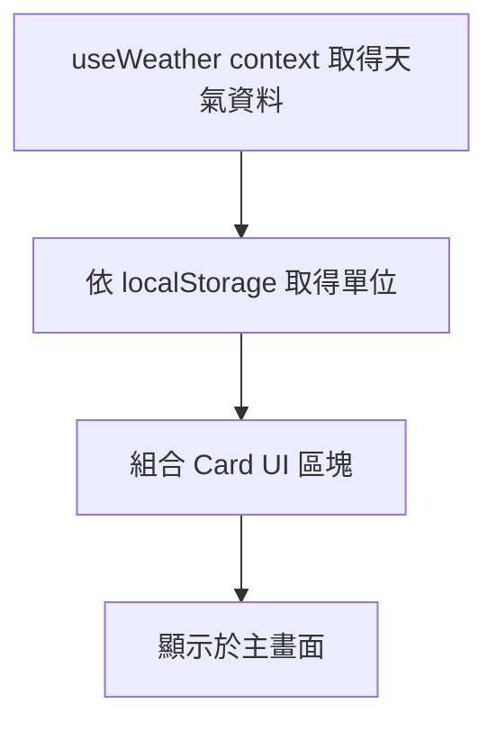

# CurrentWeatherCard - 天氣卡片元件

> 統一顯示即時天氣資訊的卡片式元件，結合 Card UI 容器與天氣資料顯示

---

##  Overview 功能概述

- 顯示即時天氣資訊（溫度、體感、風速、濕度、能見度、氣壓等）
- 以 Card UI 元件為基礎，統一外觀與區塊結構，並採用組合式設計（Card, CardHeader, CardTitle, CardContent, CardFooter, CardAction）
- 依 localStorage 設定自動切換單位（公制/英制）
- 圖示與數值分區，支援響應式設計
- 風向以 WindIcon 圖示旋轉顯示
- 主要檔案：src/components/CurrentWeatherCard.tsx、src/components/ui/card.tsx

---

##  Core Concepts 核心概念

### 1. Card UI 元件組合與設計

每個區塊（Header/Content/Footer/Action）皆為獨立元件，可彈性組合天氣資訊區塊，並集中管理樣式，方便維護與擴充。

### 2. 天氣資料與單位切換

透過 useWeather context 取得天氣資料，並依 localStorage 單位設定顯示對應單位。

---

##  Code Walkthrough 程式碼解析

```tsx
import {
  Card,
  CardHeader,
  CardTitle,
  CardContent,
  CardFooter,
} from "@/components/ui/card";

<Card>
  <CardHeader>
    <CardTitle>標題</CardTitle>
  </CardHeader>
  <CardContent>內容</CardContent>
  <CardFooter>頁腳</CardFooter>
</Card>;
```

---

##  Usage 使用方式

```tsx
// 一般卡片用法
<Card size="sm">
  <CardHeader>
    <CardTitle>小型卡片</CardTitle>
  </CardHeader>
  <CardContent>內容</CardContent>
</Card>;

// 天氣卡片元件用法
import { CurrentWeatherCard } from "@/components/CurrentWeatherCard";
<CurrentWeatherCard />;
```

---

##  Flow Diagram 流程圖



---

##  Key Points 重點總結

- 統一 UI 樣式，易於維護
- 彈性組合資訊區塊
- 支援單位自動切換
- 風向圖示動態旋轉

---

##  Advanced Topics 進階概念

- 可擴充更多天氣指標（如紫外線、降雨量等）
- 可結合主題色彩自動切換

---

## 相關依賴與檔案

- @phosphor-icons/react
- useWeather context
- config/index.ts (UNITS, APP, OPENWEATHERMAP_API)
- src/components/ui/card.tsx, src/components/ui/skeleton.tsx
- src/components/CurrentWeatherCard.tsx
- src/config/Unit.ts
- src/hooks/useWeather.ts

## 版本紀錄

- 2026/03/15：初版建立，結合 Card UI 與天氣資訊顯示。
