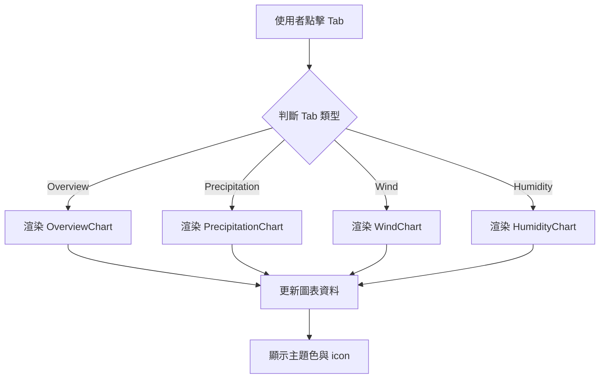

# HourlyTab - 小時天氣分頁模組

> 本文件涵蓋 HourlyTab 主要功能、設計規則、圖表與 icon 調用標準

---

##  Overview 功能概述

- 小時天氣分頁主元件，包含溫度、體感溫度、降水等多種圖表
- 檔案：HourlyWeatherTabs.tsx、OverviewChart.tsx、PrecipitationChart.tsx
- 與主題色、UI library、index.css 配色高度整合

---

##  Core Concepts 核心概念

- 主題色覆蓋：所有顏色用 index.css 變數或 oklch 色碼
- className 覆蓋加 !important，確保主題色顯示
- 不修改 UI library 原生檔案
- icon 調用標準：本地 svg 圖標，或 phosphor-icons/react

---

##  Code Walkthrough 程式碼解析

```tsx
import { ThermometerIcon } from "@phosphor-icons/react";
<ThermometerIcon size={16} fill="currentColor" />

<Area
	dataKey="feels"
	stroke="oklch(0.60276 0.17218 303.962)" // 紫色
	...
/>
```

---

##  Usage 使用方式

```tsx
<HourlyWeatherTabs />
```

---

##  Flow Diagram 流程圖



---

##  Key Points 重點總結

- 主題色與 className 覆蓋規則
- icon 調用標準
- 圖表設計感與辨識度

---

## Advanced Topics 進階概念

---

## Staged Change Summary & Notes

### 本次 staged change 摘要：

- 新增 HumidityChart.tsx，支援小時濕度與露點圖表，主題色漸層與紫色對比線條。
- HourlyWeatherTabs.tsx 新增 Humidity tab，動態渲染 HumidityChart。
- WindChart.tsx、HumidityChart.tsx 均採用 index.css 變數與 oklch 色碼，設計感統一。
- OverviewChart.tsx、WindChart.tsx 漸層 stopOffset 統一調整為 50%，視覺更協調。
- 圖表 legend、tooltip、主題色覆蓋皆符合標準規則。

### 心得筆記：

- HourlyTab 模組擴充性佳，tab 新增只需補 Chart 元件與資料欄位。
- 主題色與漸層設計可用 index.css 變數與 oklch 色碼靈活調整，UI 一致性高。
- icon 調用建議統一用 phosphor-icons/react 或本地 svg，標題與章節 icon 依 docs/standard 規範。
- 圖表設計上，對比色（如紫色）可提升辨識度，漸層區域與主題色搭配效果佳。
- stopOffset 統一後，所有圖表漸層視覺一致，細節更精緻。
