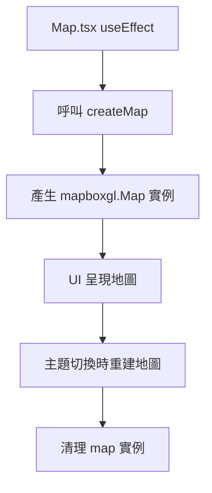

# Map - 地圖 UI 元件

> 本文件說明 Map.tsx 元件的 UI 職責、生命週期管理、型別安全與與服務層互動最佳實踐

---

##  Overview 功能概述

- Map.tsx 負責地圖 UI 呈現、主題切換、地圖生命週期管理
- 不直接操作 mapbox-gl，統一呼叫服務層 createMap
- 與 ThemeFunc 型別安全整合，確保主題切換一致

---

##  Core Concepts 核心概念

### 1. UI/Service 分層

- UI 元件只負責渲染與事件，所有地圖操作統一走 createMap

### 2. 型別安全

- theme 僅接受 THEME_ENUM，與主題系統一致

---

##  Code Walkthrough 程式碼解析

```tsx
// Map.tsx
useEffect(() => {
  if (!weather || !weather.location) return;
  if (!mapContainerRef.current) return;
  const mapInstance = createMap(
    mapContainerRef.current,
    [weather.location.lon, weather.location.lat],
    theme,
    MAPBOX.DEFAULTS.ZOOM,
  );
  setMap(mapInstance);
  return () => mapInstance.remove();
}, [theme, weather]);
```

---

##  Usage 使用方式

```tsx
import { useTheme } from "@/components/themeFunc/ThemeProvider";
import { createMap } from "@/api/Mapbox";
// 於 useEffect 內呼叫 createMap
```

---

##  Flow Diagram 流程圖



---

##  Key Points 重點總結

- UI/服務分層，元件不直接操作 mapbox-gl
- theme 型別安全，與主題系統一致
- useEffect 依賴正確，map 實例清理安全

---

##  Advanced Topics 進階概念

- 可擴充更多地圖互動功能，仍建議統一封裝於服務層
- 建議所有地圖副作用都集中於 useEffect，避免記憶體洩漏

---

##  Marker 標記元件教學

- Map 元件會自動串接 Marker，顯示天氣資訊於地圖中心。
- Marker 元件說明請見 [Marker.md](./Marker.md)
