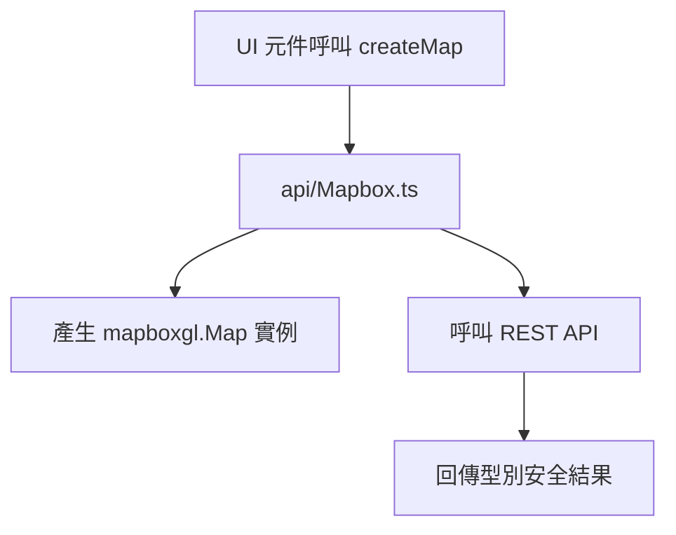

# Mapbox API 服務層 - 地圖初始化與 REST API

> 本文件說明 api/Mapbox.ts 的服務分層、型別安全設計與最佳實踐

---

##  Overview 功能概述

- api/Mapbox.ts 封裝地圖初始化（createMap）與 Mapbox REST API 服務（geocode, getDirections, getStaticMapUrl）
- 提供型別安全的 API 介面，UI 元件不直接操作 mapbox-gl
- theme 參數與 THEME_ENUM 型別安全整合

---

##  Core Concepts 核心概念

### 1. 服務分層

- 地圖初始化、REST API、型別定義全部集中於 api/Mapbox.ts
- UI 元件僅呼叫 createMap，不直接依賴 mapbox-gl

### 2. 型別安全

- createMap 參數型別明確，theme 僅接受 THEME_ENUM
- Mapbox API 回傳型別皆有 interface 定義

---

##  Code Walkthrough 程式碼解析

```typescript
// api/Mapbox.ts
export function createMap(
  container: HTMLElement,
  center: [number, number],
  theme: Theme,
  zoom: number = MAPBOX.DEFAULTS.ZOOM
): mapboxgl.Map {
  mapboxgl.accessToken = import.meta.env.VITE_MAPBOX_API_KEY;
  return new mapboxgl.Map({
    container,
    center,
    zoom,
    style:
      theme === THEME_ENUM.LIGHT
        ? "mapbox://styles/mapbox/streets-v11"
        : "mapbox://styles/mapbox/dark-v11",
  });
}

export async function geocode(...) { /* ... */ }
export async function getDirections(...) { /* ... */ }
export function getStaticMapUrl(...) { /* ... */ }
```

---

##  Usage 使用方式

```typescript
import { createMap, geocode, getDirections } from "@/api/Mapbox";
import { THEME_ENUM } from "@/components/themeFunc/ThemeContext";

const map = createMap(container, [lon, lat], THEME_ENUM.DARK, zoom);
```

---

##  Flow Diagram 流程圖



---

##  Key Points 重點總結

- 服務分層，UI 不直接操作 mapbox-gl
- createMap 參數型別安全，theme 僅接受 THEME_ENUM
- Mapbox API 服務皆有型別定義

---

##  Advanced Topics 進階概念

- 可擴充更多地圖互動功能，建議統一封裝於 api/Mapbox.ts
- 若需多地圖主題，可擴充 THEME_ENUM 與 style 對應表
- 建議所有地圖副作用都集中於 useEffect，避免記憶體洩漏
