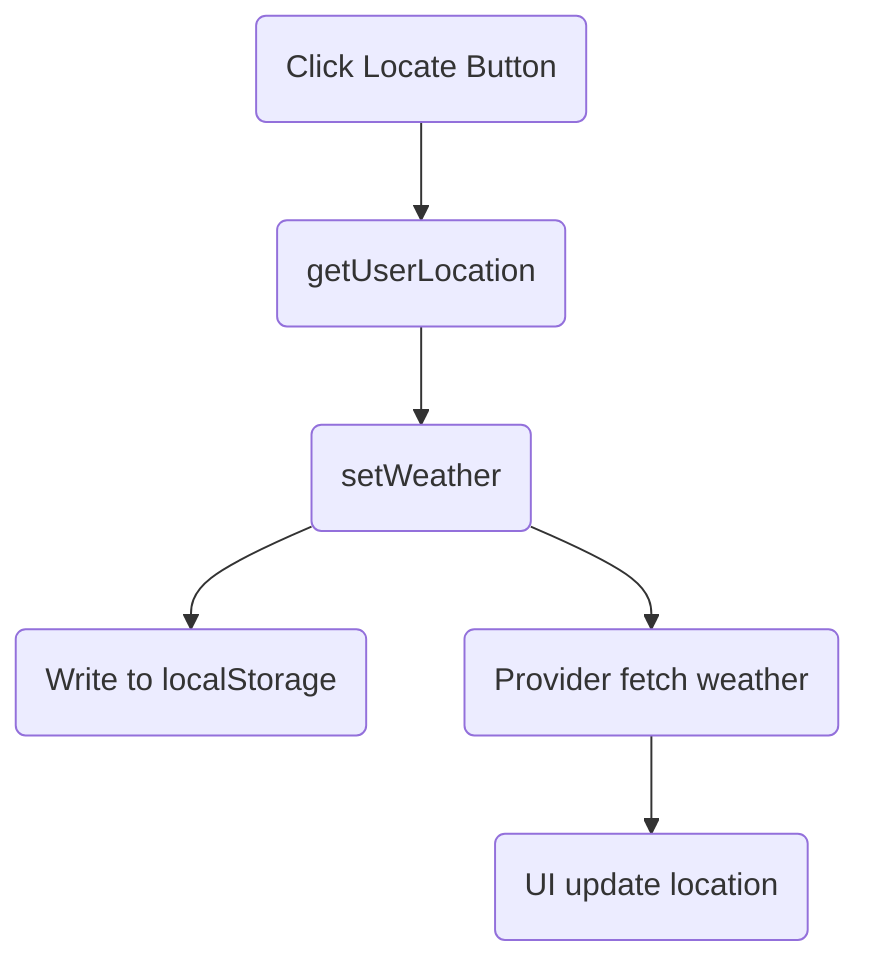

# PageHeader - 天氣地點標題元件

> 顯示目前天氣地點、支援定位、與天氣 Provider 整合

---

##  Overview 功能概述

PageHeader 元件負責：

- 顯示目前天氣地點（城市、州、省、國家）
- 提供一鍵定位功能，取得使用者地理位置並更新天氣
- 整合 useWeather Hook 與 setWeather，與天氣 Provider 互動
- 將定位結果寫入 localStorage，實現持久化

檔案位置：`src/components/PageHeader.tsx`

---

##  Core Concepts 核心概念

### 1. useWeather Hook

PageHeader 透過 useWeather 取得 weather 狀態與 setWeather 方法：

```typescript
const { weather, setWeather } = useWeather();
```

### 2. 定位與 localStorage

點擊定位按鈕時，會呼叫 getUserLocation 取得經緯度，並：

- 呼叫 setWeather({ lat, lon }) 觸發天氣查詢
- 將經緯度寫入 localStorage，供 Provider fallback 使用

### 3. UI/UX 行為

- 未取得 weather 前顯示 Skeleton loading
- 取得後顯示地點資訊
- 定位按鈕有 icon，點擊時有 loading/錯誤提示

---

##  Code Walkthrough 程式碼解析

```tsx
import { APP } from "@/config";
import { getUserLocation } from "@/lib/utils";
import { useWeather } from "@/hooks/useWeather";
import { Button } from "@/components/ui/button";
import { Skeleton } from "./ui/skeleton";
import { MapPinAreaIcon } from "@phosphor-icons/react";

export const PageHeader = () => {
  const { weather, setWeather } = useWeather();
  if (!weather) return <Skeleton className="w-40 h-4 mt-2 mb-6" />;
  return (
    <div className="flex items-center gap-4 mb-4">
      <h2>
        {weather.location.name},
        {weather.location.state ? ` ${weather.location.state},` : ""}
        {weather.location.country}
      </h2>
      <Button
        variant="outline"
        size="icon-sm"
        onClick={async () => {
          try {
            const { latitude, longitude } = await getUserLocation();
            setWeather({ lat: latitude, lon: longitude });
            localStorage.setItem(APP.STORE_KEY.LATITUDE, String(latitude));
            localStorage.setItem(APP.STORE_KEY.LONGITUDE, String(longitude));
          } catch (error) {
            alert(`Error getting user location: ${error}`);
          }
        }}
      >
        <MapPinAreaIcon />
      </Button>
    </div>
  );
};
```

---

##  Usage 使用方式

```tsx
import { PageHeader } from "@/components/PageHeader";

export const TopAppBar = () => (
  <header>
    <PageHeader />
  </header>
);
```

前提：外層必須已包住 OpenWeatherMapProvider，否則 useWeather() 會報錯。

---

##  Flow Diagram 流程圖



---

##  Key Points 重點總結

- PageHeader 整合地點顯示、定位、Provider 狀態管理
- 定位結果會寫入 localStorage，供天氣 Provider fallback
- 必須在 Provider 內部使用 useWeather
- UI/UX 友善，支援 loading、錯誤提示
