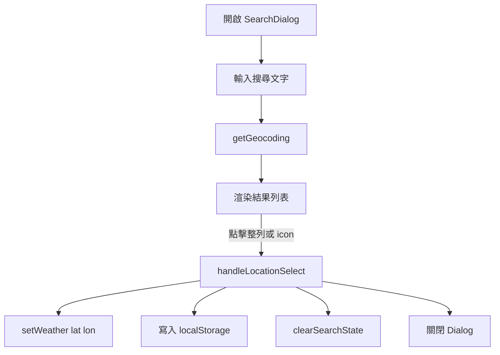

# SearchDialog - 搜尋對話框功能

> 地理位置搜尋、結果選取與對話框清理流程

---

##  Overview 功能概述

`SearchDialog` 負責：

- 使用 `⌘ + K` / `Ctrl + K` 或按鈕開啟搜尋
- 透過 `getGeocoding` 搜尋城市或國家
- 點擊整列結果或右側 icon 後，更新目前天氣位置
- 在關閉前清空搜尋文字與結果，避免殘留資料

**檔案位置**：`src/components/SearchDialog.tsx`

---

##  Core Concepts 核心概念

### 1. 受控 Dialog

```typescript
const [isOpenSearchDialog, setIsOpenSearchDialog] = useState<boolean>(false);

<Dialog open={isOpenSearchDialog} onOpenChange={handleDialogToggle}>
```

開關狀態集中在同一個 state，關閉時才能統一做 cleanup。

### 2. 即時搜尋

```typescript
useEffect(() => {
  if (!search) return;

  (async () => {
    const geoRes = await geoCoding(search);
    if (geoRes && geoRes.length > 0) setResults(geoRes);
  })();
}, [search, geoCoding]);
```

目前仍是每次輸入即查詢，尚未加入 debounce。

### 3. 私有清理函式

```typescript
const clearSearchState = () => {
  setSearch("");
  setResults([]);
};
```

這個私有方法同時被兩條路徑共用：

- `handleDialogToggle(false)`
- `handleLocationSelect()`

因此無論是手動關閉 dialog，還是點擊搜尋結果，都會在關閉前清空資料。

### 4. 整列可點擊，不只 icon

```typescript
<Item
  role="button"
  tabIndex={0}
  onClick={() => handleLocationSelect(lat, lon)}
  onKeyDown={(e) => {
    if (e.key === "Enter" || e.key === " ") {
      e.preventDefault();
      handleLocationSelect(lat, lon);
    }
  }}
/>
```

搜尋結果現在支援：

- 滑鼠點整列
- 滑鼠點 icon
- 鍵盤 `Enter` / `Space`

### 5. Base UI 的 render pattern

這個專案的 Dialog / Button 封裝走的是 Base UI `render` pattern，不是 Radix 的 `asChild`。

---

##  Key Flow 關鍵流程

### 選取搜尋結果

```typescript
const handleLocationSelect = (lat: number, lon: number) => {
  setWeather({ lat, lon });
  localStorage.setItem(APP.STORE_KEY.LATITUDE, String(lat));
  localStorage.setItem(APP.STORE_KEY.LONGITUDE, String(lon));
  clearSearchState();
  setIsOpenSearchDialog(false);
};
```

這裡一次完成 4 件事：

1. 觸發 Provider 重新查詢天氣
2. 保存位置到 localStorage
3. 清空輸入框與結果
4. 關閉 dialog

### 避免 icon 點擊重複觸發

```typescript
onClick={(e) => {
  e.stopPropagation();
  handleLocationSelect(lat, lon);
}}
```

因為整列 `Item` 已經可點，所以 icon 內要 `stopPropagation()`，不然會冒泡到外層再執行一次。

### 互動回饋

```typescript
className="
relative p-2 cursor-pointer transition-all duration-150
hover:bg-muted/80 active:scale-[0.99] active:bg-muted"
```

目前結果列具備：

- `hover` 高亮
- `active` 顏色回饋
- `active` 輕微縮放

---

##  Usage 使用方式

```typescript
import { SearchDialog } from "@/components/SearchDialog";

export const TopAppBar = () => {
  return (
    <header>
      <SearchDialog />
    </header>
  );
};
```

前提是外層必須已經包住 `OpenWeatherMapProvider`，否則 `useWeather()` 無法使用。

---

##  Flow Diagram 流程圖



---

##  Key Points 重點總結

- SearchDialog 不只負責搜尋，也負責把選中的位置交給天氣 Provider
- 清空邏輯已集中到 `clearSearchState()`，避免不同關閉路徑遺漏
- 搜尋結果整列可點，icon 點擊只是一個額外入口
- 目前仍可考慮補 `debounce`，減少輸入時 API 請求數量
