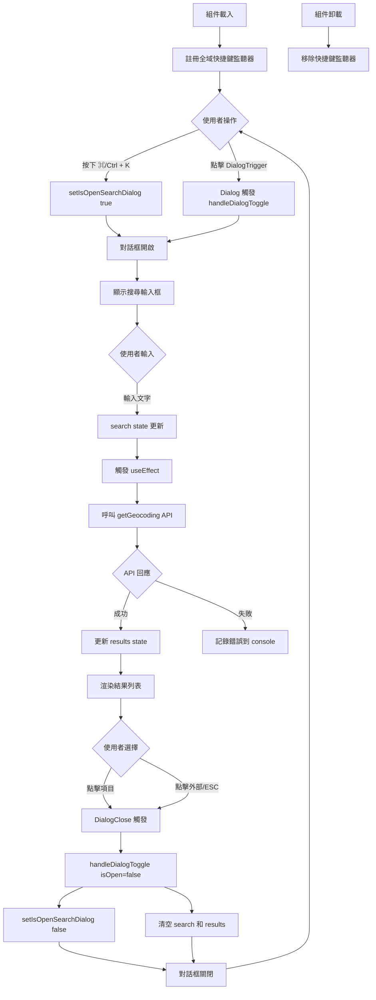
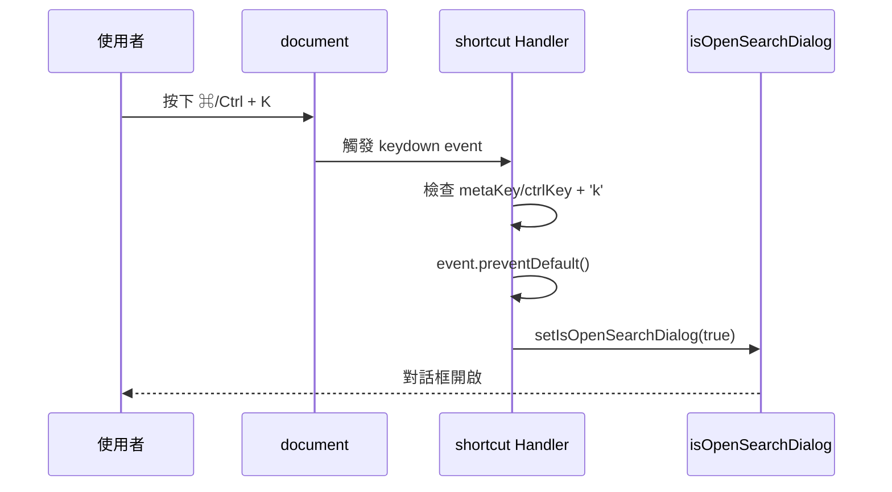
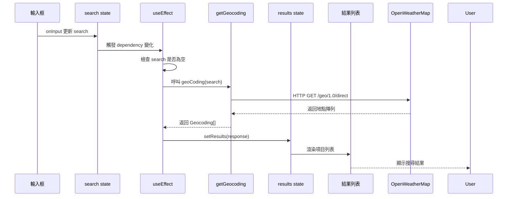
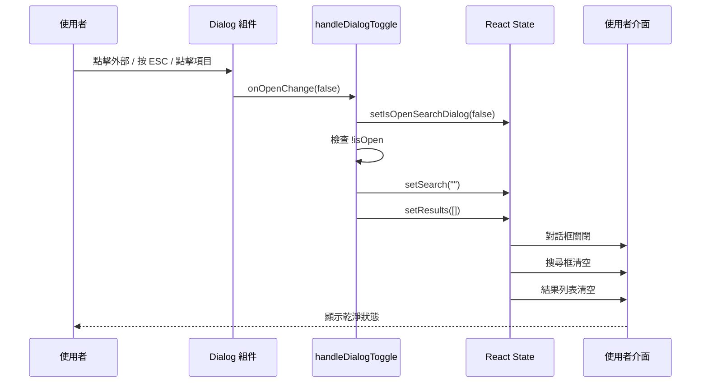

# SearchDialog - 搜尋對話框功能

> 地理位置搜尋與選擇介面

---

##  功能概述

SearchDialog 是一個全域搜尋對話框組件，讓使用者能夠：

- 透過城市或國家名稱搜尋地理位置
- 使用快捷鍵 `⌘ + K` (Mac) 或 `Ctrl + K` (Windows) 快速開啟搜尋
- 查看搜尋結果列表，包含城市名稱、州/省、國家資訊
- 點擊地點來選擇位置（與天氣資料整合）

**檔案位置**：`src/components/SearchDialog.tsx`

---

##  核心概念

### 1. 受控對話框 (Controlled Dialog)

使用 React state 來控制對話框的開啟/關閉狀態：

```typescript
const [isOpenSearchDialog, setIsOpenSearchDialog] = useState<boolean>(false);
```

### 2. 全域鍵盤快捷鍵 (Global Keyboard Shortcut)

透過監聽 `document` 的 `keydown` 事件實現全域快捷鍵：

```typescript
useEffect(() => {
  const shortcut = (event: KeyboardEvent) => {
    if ((event.metaKey || event.ctrlKey) && event.key.toLowerCase() === "k") {
      event.preventDefault();
      setIsOpenSearchDialog(true);
    }
  };

  document.addEventListener("keydown", shortcut);
  return () => document.removeEventListener("keydown", shortcut);
}, []);
```

**關鍵點**：

- `event.metaKey`：Mac 的 Command (⌘) 鍵
- `event.ctrlKey`：Windows/Linux 的 Ctrl 鍵
- `event.preventDefault()`：防止瀏覽器預設行為（如某些快捷鍵）
- cleanup function：組件卸載時移除監聽器，避免記憶體洩漏

### 3. 地理編碼 API (Geocoding API)

使用 OpenWeatherMap Geocoding API 搜尋地理位置：

```typescript
const geoCoding = useCallback(async (search: string) => {
  if (!search) return;

  try {
    const response = await getGeocoding(search);
    setResults(response);
    return response;
  } catch (error) {
    console.error("Geocoding error:", error);
  }
}, []);
```

### 4. 即時搜尋 (Real-time Search)

使用 `useEffect` 監聽搜尋輸入變化，自動觸發 API 查詢：

```typescript
useEffect(() => {
  if (!search) return;

  (async () => {
    const geoRes = await geoCoding(search);
    if (geoRes && geoRes.length > 0) setResults(geoRes);
  })();
}, [search, geoCoding]);
```

⚠️ **注意**：目前實作每次輸入都會觸發 API 請求，未來應加入防抖 (debounce) 機制優化效能。

### 5. Base UI Render Prop Pattern

Base UI 組件使用 `render` prop 而非 `asChild`：

```typescript
<DialogTrigger
  render={
    <Button variant="ghost">
      <MagnifyingGlassIcon />
    </Button>
  }
/>
```

這與 Radix UI 的 `asChild` 模式不同。

### 6. 統一的對話框狀態管理 (Dialog State Management)

使用 `handleDialogToggle` 函數統一處理對話框的開啟/關閉，並在關閉時自動清理：

```typescript
const handleDialogToggle = (isOpen: boolean) => {
  setIsOpenSearchDialog(isOpen);
  if (!isOpen) {
    setSearch("");      // 關閉時清空搜尋框
    setResults([]);     // 清空搜尋結果
  }
};

// 綁定到 Dialog 的 onOpenChange
<Dialog open={isOpenSearchDialog} onOpenChange={handleDialogToggle}>
```

**關鍵點**：

- `onOpenChange` 在對話框狀態改變時自動觸發（開啟或關閉）
- 參數 `isOpen` 為新的狀態（`true` 表示開啟，`false` 表示關閉）
- 關閉時 (`!isOpen`) 自動清理搜尋框和結果，確保下次開啟時是乾淨狀態
- 避免在 DialogTrigger 的 `onClick` 中直接修改狀態
- 符合單一職責原則，所有狀態管理邏輯集中在一處

---

##  程式碼解析

### 組件結構

```typescript
export const SearchDialog = () => {
  // State
  const [search, setSearch] = useState<string>("");
  const [results, setResults] = useState<Geocoding[]>([]);
  const [isOpenSearchDialog, setIsOpenSearchDialog] = useState<boolean>(false);

  // Request
  const geoCoding = useCallback(async (search: string) => { ... }, []);

  // Keyboard shortcut
  useEffect(() => { ... }, []);

  // Search API Caller
  useEffect(() => { ... }, [search, geoCoding]);

  // Handle dialog toggle and cleanup
  const handleDialogToggle = (isOpen: boolean) => {
    setIsOpenSearchDialog(isOpen);
    if (!isOpen) {
      setSearch("");
      setResults([]);
    }
  };

  return (
    <Dialog open={isOpenSearchDialog} onOpenChange={handleDialogToggle}>
      <DialogTrigger />
      <DialogContent>
        <InputGroup /> {/* 搜尋輸入框 */}
        <ItemGroup />   {/* 結果列表 */}
      </DialogContent>
    </Dialog>
  );
};
```

### 1. 對話框觸發按鈕

```typescript
<DialogTrigger
  render={
    <Button
      variant="ghost"
      className="me-auto max-lg:size-9 lg:bg-secondary dark:lg:bg-secondary/50"
      // 不需要 onClick - 讓 Dialog 自動處理
    >
      <MagnifyingGlassIcon className="lg:text-muted-foreground" />

      <div className="flex justify-between w-[250px] max-lg:hidden uppercase">
        search weather...
        <kbd className="ml-2">
          <KbdGroup>
            <Kbd>⌘</Kbd>
            <Kbd>K</Kbd>
          </KbdGroup>
        </kbd>
      </div>
    </Button>
  }
/>
```

**設計特點**：

- 響應式設計：大螢幕顯示完整文字和快捷鍵提示，小螢幕只顯示圖示
- `max-lg:size-9`：在小於 lg 尺寸時，按鈕變為正方形圖示
- `max-lg:hidden`：隱藏文字和快捷鍵提示

### 2. 搜尋輸入框

```typescript
<InputGroup className="p-4 ring-0! border-t-0! border-x-0! border-b border-border! rounded-b-none bg-transparent">
  <InputGroupInput
    className="capitalize"
    placeholder="Search city or country..."
    value={search}
    onInput={(e) => setSearch(e.currentTarget.value)}
  />
  <InputGroupAddon>
    <MagnifyingGlassIcon />
  </InputGroupAddon>
</InputGroup>
```

**樣式技巧**：

- `ring-0!`：移除預設的 focus ring
- `border-t-0! border-x-0!`：只保留下邊框
- `capitalize`：輸入文字首字母大寫（UI 樣式，不影響實際查詢）

### 3. 結果列表渲染

```typescript
<ItemGroup className="min-h-96 p-2 overflow-y-auto">
  {!results.length && (
    <p className="text-center text-sm py-4">No results found.</p>
  )}
  {results.map(({ name, lat, lon, state, country }) => (
    <Item key={`${name}-${lat}-${lon}`} size="sm" className="relative p-2">
      <ItemContent>
        <ItemTitle className="capitalize">{name}</ItemTitle>
        <ItemDescription>
          {state ? `${state}, ` : "UNK-STATE"}
          {country ? `${country}` : "UNK-COUNTRY"}
        </ItemDescription>
      </ItemContent>

      <ItemActions>
        <DialogClose
          render={
            <Button
              variant="ghost"
              size="icon"
              className="after:absolute after:inset-0"
              onClick={() => {}}
            >
              <MapPinAreaIcon />
            </Button>
          }
        />
      </ItemActions>
    </Item>
  ))}
</ItemGroup>
```

**關鍵設計**：

- `key={`${name}-${lat}-${lon}`}`：使用複合 key 確保唯一性
- `after:absolute after:inset-0`：偽元素覆蓋整個 Item 區域，增加點擊範圍
- 空狀態處理：無結果時顯示 "No results found."

---

##  使用方式

### 基本使用

在任何需要搜尋功能的地方引入組件：

```typescript
import { SearchDialog } from "@/components/SearchDialog";

function App() {
  return (
    <div>
      <SearchDialog />
      {/* 其他內容 */}
    </div>
  );
}
```

### 開啟搜尋對話框的方式

1. **點擊觸發按鈕**：點擊頁面上的 "SEARCH WEATHER..." 按鈕
2. **使用快捷鍵**：
   - Mac：`⌘ + K`
   - Windows/Linux：`Ctrl + K`

### 搜尋流程

1. 開啟對話框（點擊觸發按鈕或按快捷鍵 ⌘/Ctrl + K）
2. 在輸入框輸入城市或國家名稱
3. 每次輸入變化時自動觸發 API 查詢
4. 查詢結果即時顯示在列表中
5. 點擊結果項目的地圖圖示選擇該地點
6. 對話框關閉時自動清空搜尋框和結果（透過 `handleDialogToggle`）

---

##  流程圖

### 搜尋對話框生命週期



### 快捷鍵事件流程



### API 查詢流程



### 對話框關閉與清理流程



---

##  重點總結

### ✅ 核心知識點

1. **全域快捷鍵實作**
   - 使用 `document.addEventListener("keydown", handler)`
   - 必須在 cleanup function 中移除監聽器
   - 區分 Mac (`metaKey`) 和 Windows (`ctrlKey`)

2. **受控組件模式**
   - 對話框狀態由 React state 控制
   - 輸入框使用受控模式（`value` + `onInput`）
   - 符合 React 單向資料流原則

3. **useCallback 記憶化**
   - API 呼叫函式使用 `useCallback` 避免重複建立
   - dependency array 為空 `[]` 表示函式定義不會改變

4. **useEffect 副作用管理**
   - 監聽 `search` 變化自動觸發 API 查詢
   - 記得處理空值情況避免無效請求

5. **Base UI 組件模式**
   - 使用 `render` prop 而非 `asChild`
   - 與 Radix UI 的 API 差異

6. **統一的狀態管理處理器**
   - 使用 `handleDialogToggle` 統一管理對話框開關
   - 在同一處理器中處理清理邏輯
   - 避免狀態管理邏輯分散導致的錯誤

### ⚠️ 注意事項

1. **效能優化需求**
   - 目前每次輸入都會觸發 API 請求
   - 建議加入 debounce（800ms 延遲）
   - 或改為手動觸發（按 Enter 或點擊按鈕）

2. **API 錯誤處理**
   - 目前只有 `console.error` 記錄
   - 應該向使用者顯示友善錯誤訊息

3. **無障礙性 (Accessibility)**
   - DialogHeader 使用 `sr-only` 對螢幕閱讀器友善
   - 快捷鍵應在 UI 中明確提示使用者

4. **記憶體管理**
   - 必須清理事件監聽器（`removeEventListener`）
   - 避免組件卸載後仍執行 setState

5. **對話框狀態管理的常見陷阱**
   - ⚠️ **不要在 DialogTrigger 的 onClick 中直接改變狀態**

   **錯誤做法**：

   ```typescript
   <DialogTrigger
     render={
       <Button onClick={() => setIsOpenSearchDialog(prev => !prev)}>
         {/* 這樣會繞過 onOpenChange 處理器 */}
       </Button>
     }
   />
   ```

   **正確做法**：

   ```typescript
   // 讓 Dialog 組件自動處理狀態，透過 onOpenChange 統一管理
   <Dialog open={isOpenSearchDialog} onOpenChange={handleDialogToggle}>
     <DialogTrigger render={<Button>{/* 不需要 onClick */}</Button>} />
   </Dialog>

   const handleDialogToggle = (isOpen: boolean) => {
     setIsOpenSearchDialog(isOpen);
     if (!isOpen) {
       setSearch("");      // 關閉時清空
       setResults([]);
     }
   };
   ```

   **為什麼？**
   - `onOpenChange` 在開啟/關閉時都會觸發，行為統一
   - 可以在同一個地方處理清理邏輯
   - 避免狀態管理邏輯分散在多處
   - 符合單一職責原則

6. **避免 useEffect 中的級聯渲染**
   - ❌ 不要在 useEffect 中根據狀態變化同步調用 setState

   **錯誤做法**：

   ```typescript
   useEffect(() => {
     if (!isOpenSearchDialog) {
       setSearch(""); // ⚠️ 會觸發級聯渲染警告
       setResults([]);
     }
   }, [isOpenSearchDialog]);
   ```

   **正確做法**：在事件處理器中直接處理（如上面的 `handleDialogToggle`）

---

##  進階概念

### 1. 防抖優化 (Debounce)

**問題**：每次輸入都觸發 API 請求，浪費網路資源且可能造成競態條件 (race condition)。

**解決方案**：使用防抖延遲執行

```typescript
useEffect(() => {
  if (!search.trim()) return;

  const timeoutId = setTimeout(() => {
    geoCoding(search);
  }, 800); // 使用者停止輸入 800ms 後才查詢

  return () => clearTimeout(timeoutId);
}, [search, geoCoding]);
```

### 2. 取消先前的請求 (Request Cancellation)

**問題**：快速輸入時，舊的請求可能比新的請求晚回應，造成結果錯誤。

**解決方案**：使用 AbortController

```typescript
useEffect(() => {
  if (!search.trim()) return;

  const controller = new AbortController();

  const fetchData = async () => {
    try {
      const response = await getGeocoding(search, {
        signal: controller.signal,
      });
      setResults(response);
    } catch (error) {
      if (error.name === "AbortError") return; // 請求被取消，正常情況
      console.error("Geocoding error:", error);
    }
  };

  fetchData();

  return () => controller.abort(); // 取消進行中的請求
}, [search]);
```

### 3. 快取機制 (Caching)

**問題**：重複搜尋相同關鍵字會重複請求。

**解決方案**：使用 Map 快取

```typescript
const cacheRef = useRef<Map<string, Geocoding[]>>(new Map());

const geoCoding = useCallback(async (search: string) => {
  // 檢查快取
  if (cacheRef.current.has(search)) {
    return cacheRef.current.get(search);
  }

  const response = await getGeocoding(search);

  // 儲存到快取
  cacheRef.current.set(search, response);

  return response;
}, []);
```

### 4. 載入狀態管理

**問題**：使用者不知道是否正在查詢中。

**解決方案**：加入 loading state

```typescript
const [isLoading, setIsLoading] = useState(false);

const geoCoding = useCallback(async (search: string) => {
  setIsLoading(true);
  try {
    const response = await getGeocoding(search);
    setResults(response);
  } finally {
    setIsLoading(false);
  }
}, []);

// UI 中顯示載入指示器
{isLoading && <Spinner />}
```

### 5. 鍵盤導航 (Keyboard Navigation)

**進階 UX**：使用上下鍵選擇結果項目

```typescript
const [selectedIndex, setSelectedIndex] = useState(0);

const handleKeyDown = (e: KeyboardEvent) => {
  switch (e.key) {
    case "ArrowDown":
      e.preventDefault();
      setSelectedIndex((prev) => Math.min(prev + 1, results.length - 1));
      break;
    case "ArrowUp":
      e.preventDefault();
      setSelectedIndex((prev) => Math.max(prev - 1, 0));
      break;
    case "Enter":
      if (results[selectedIndex]) {
        handleSelect(results[selectedIndex]);
      }
      break;
  }
};
```

---

##  檢查清單

完成以下檢查項目，確認你已經掌握 SearchDialog 的核心概念：

### 基礎理解

- [ ] 能夠解釋什麼是「受控組件」
- [ ] 理解 `useEffect` 的 dependency array 如何影響執行時機
- [ ] 知道為什麼需要 cleanup function
- [ ] 理解 `useCallback` 的作用

### 實作技巧

- [ ] 能夠實作全域鍵盤快捷鍵監聽
- [ ] 知道如何正確移除事件監聽器
- [ ] 能夠使用 Base UI 的 `render` prop pattern
- [ ] 理解如何處理 API 非同步請求
- [ ] 能夠實作統一的對話框狀態管理處理器
- [ ] 知道為什麼不應該在 DialogTrigger 的 onClick 中直接改狀態
- [ ] 理解如何在事件處理器中進行清理而非 useEffect

### 進階概念

- [ ] 能夠實作防抖優化
- [ ] 理解請求取消的必要性
- [ ] 知道如何實作簡單的快取機制
- [ ] 能夠加入載入狀態提升 UX

### 效能優化

- [ ] 識別出目前實作的效能問題
- [ ] 能夠提出至少 3 種優化方案
- [ ] 理解記憶體洩漏的風險點

---

##  相關資源

### 官方文檔

- [React Hooks - useEffect](https://react.dev/reference/react/useEffect)
- [React Hooks - useCallback](https://react.dev/reference/react/useCallback)
- [MDN - KeyboardEvent](https://developer.mozilla.org/en-US/docs/Web/API/KeyboardEvent)
- [MDN - AbortController](https://developer.mozilla.org/en-US/docs/Web/API/AbortController)

### 相關文檔

- [API.md](./API.md) - API 服務層架構
- [OpenWeatherMap.md](./apis/OpenWeatherMap.md) - Geocoding API 詳細說明

### 推薦閱讀

- [React Hook 最佳實踐](https://react.dev/learn/you-might-not-need-an-effect)

---

<br/>

**文檔建立日期**：2026年3月12日
<br/>
**最後更新**：2026年3月13日
<br/>
**相關組件**：`src/components/SearchDialog.tsx`
