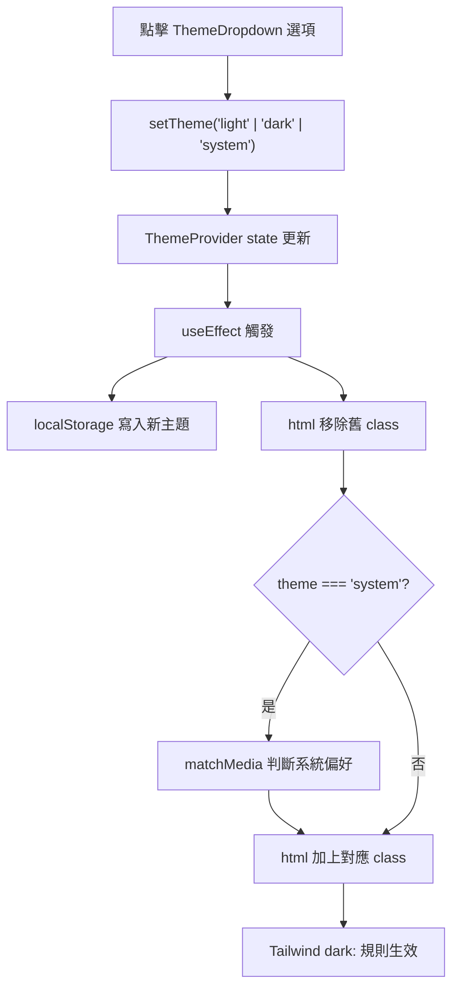

# ThemeFunc - 主題切換功能

> ThemeProvider、ThemeDropdown 與 useTheme Hook

---

##  Overview 功能概述

這個功能由 2 個檔案組成：

- `src/components/themeFunc/ThemeProvider.tsx`：管理全域主題狀態、提供 Context，並同時匯出 `useTheme` Hook
- `src/components/themeFunc/ThemeDropdown.tsx`：觸發按鈕（SunIcon / MoonIcon 動畫）與三個主題選項

> **與 OpenWeatherMapFunc 的設計差異**：ThemeFunc 沒有獨立的 context 檔案，`themeProviderContext` 是定義在 `ThemeProvider.tsx` 內部的 local 變數，`useTheme` 也從同一個檔案 export。

它的責任是把「目前主題偏好」（light / dark / system）集中管理，並透過 `<html>` 的 class 讓 Tailwind `dark:` 規則生效。

**檔案位置**：`src/components/themeFunc/`

---

##  Core Concepts 核心概念

### 1. Context 與 useTheme 在同一個檔案

不同於 `OpenWeatherMapFunc` 把 Context 拆到獨立 `.ts` 檔，ThemeFunc 的 context 只是 `ThemeProvider.tsx` 內的 local 變數：

```typescript
const themeProviderContext = createContext<ThemeProviderState>(initialState);
```

`useTheme` 也定義在同檔案中直接 export：

```typescript
export const useTheme = () => {
  const context = useContext(themeProviderContext);
  if (!context) {
    throw new Error("useTheme must be used within a ThemeProvider");
  }
  return context;
};
```

### 2. DOM class 切換是主題生效關鍵

主題效果不是靠 React 樣式直接改，而是透過 `useEffect` 操作 `<html>` 的 class：

1. 移除舊 class：`root.classList.remove("light", "dark")`
2. 加上新 class：`"light"`、`"dark"`，或 `system` 判斷後的結果

Tailwind 再根據 `.dark` 類別啟用 `dark:*` 規則。

### 3. ThemeDropdown 的 icon 行為

Trigger 按鈕使用 CSS 動畫切換兩個 icon：亮色模式顯示 `SunIcon`，暗色模式顯示 `MoonIcon`：

```tsx
<SunIcon className="scale-100 rotate-0 transition-all dark:scale-0 dark:-rotate-90" />
<MoonIcon className="absolute scale-0 rotate-90 transition-all dark:scale-100 dark:rotate-0" />
```

每個主題選項也各帶一個 icon：`SunIcon`（Light）、`MoonIcon`（Dark）、`LaptopIcon`（System）。

### 4. Base UI render prop

本專案的 `DropdownMenuTrigger` 使用 Base UI 的 `render` prop，而不是 Radix 的 `asChild`：

```tsx
<DropdownMenuTrigger render={<Button variant="secondary" size="icon">...</Button>}>
```

---

##  Code Walkthrough 程式碼解析

### ThemeProvider.tsx

#### 型別定義

```typescript
type Theme = "dark" | "light" | "system";

type ThemeProviderProps = {
  children: React.ReactNode;
  defaultTheme?: Theme; // 預設："system"
  storageKey?: string; // 預設："vite-ui-theme"
};
```

#### 初始主題來源

```typescript
const [theme, setTheme] = useState<Theme>(
  () => (localStorage.getItem(storageKey) as Theme) || defaultTheme,
);
```

優先讀取 localStorage，沒有才使用 `defaultTheme`（預設為 `"system"`）。

#### 主題同步邏輯

```typescript
useEffect(() => {
  localStorage.setItem(storageKey, theme);
  const root = document.documentElement;
  root.classList.remove("light", "dark");

  if (theme === "system") {
    const systemTheme = window.matchMedia("(prefers-color-scheme: dark)")
      .matches
      ? "dark"
      : "light";
    root.classList.add(systemTheme);
    return;
  }

  root.classList.add(theme);
}, [theme, storageKey]);
```

`system` 必須透過 `matchMedia` 判斷系統偏好，不能硬寫固定 dark。

### ThemeDropdown.tsx

#### Trigger 按鈕（亮 / 暗動畫）

```tsx
<DropdownMenuTrigger
  render={
    <Button variant="secondary" size="icon">
      <SunIcon className="h-[1.2rem] w-[1.2rem] scale-100 rotate-0 transition-all dark:scale-0 dark:-rotate-90" />
      <MoonIcon className="absolute h-[1.2rem] w-[1.2rem] scale-0 rotate-90 transition-all dark:scale-100 dark:rotate-0" />
      <span className="sr-only">Toggle theme</span>
    </Button>
  }
/>
```

#### 主題選項

```tsx
<DropdownMenuItem onClick={() => setTheme("light")}>
  <SunIcon className="me-2" />
  Light
</DropdownMenuItem>
<DropdownMenuItem onClick={() => setTheme("dark")}>
  <MoonIcon className="me-2" />
  Dark
</DropdownMenuItem>
<DropdownMenuItem onClick={() => setTheme("system")}>
  <LaptopIcon className="me-2" />
  system
</DropdownMenuItem>
```

---

##  Usage 使用方式

### 包住 Provider

```tsx
import { ThemeProvider } from "@/components/themeFunc/ThemeProvider";

export const App = () => {
  return <ThemeProvider>{/* 頁面內容 */}</ThemeProvider>;
};
```

`storageKey` 預設為 `"vite-ui-theme"`，`defaultTheme` 預設為 `"system"`。

### 放入 ThemeDropdown

```tsx
import { ThemeDropdown } from "@/components/themeFunc/ThemeDropdown";

<ThemeDropdown />;
```

### 在元件內讀取主題

```tsx
import { useTheme } from "@/components/themeFunc/ThemeProvider";

const { theme, setTheme } = useTheme();
```

---

##  Flow Diagram 流程圖



---

##  Key Points 重點總結

- 主題由 `ThemeProvider` 集中控制，`ThemeDropdown` 只負責 UI 操作
- `themeProviderContext` 是 local 變數，`useTheme` 與它定義在同一個檔案（不拆分）
- `system` 必須透過 `matchMedia` 判斷，不要硬編碼
- Trigger 按鈕使用 CSS 動畫：亮色顯示 `SunIcon`，暗色顯示 `MoonIcon`
- 選項以 `onClick` 觸發切換，點擊後選單自動關閉

---

##  Advanced Topics 進階概念

### 首次載入閃爍（FOUC）

若頁面首次載入有亮暗閃爍，可考慮在 `index.html` 注入 inline script，在 React 初始化之前就讀取 localStorage 並設定 class，避免視覺閃爍。

### 監聽系統主題即時變更

目前設定 `system` 時只在 `useEffect` 觸發時讀一次系統偏好。若需要「系統主題改變後立即跟著變」，可加 `matchMedia` change listener：

```typescript
const mediaQuery = window.matchMedia("(prefers-color-scheme: dark)");
mediaQuery.addEventListener("change", callback);
return () => mediaQuery.removeEventListener("change", callback);
```
