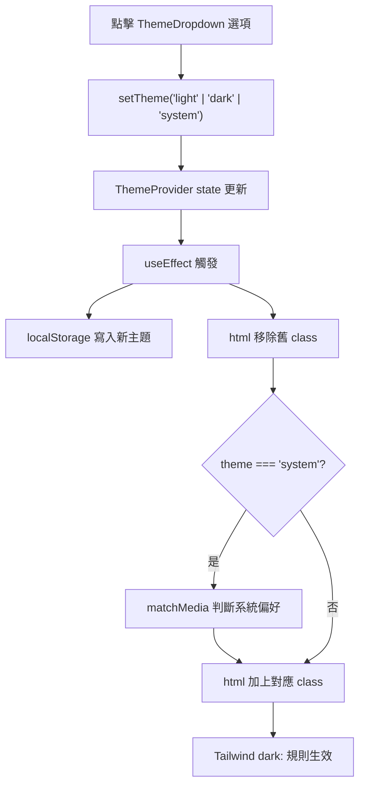

# ThemeFunc - 主題切換功能與型別安全最佳實踐

> ThemeProvider、ThemeDropdown、useTheme Hook 與 THEME_ENUM 架構

---

##  Overview 功能概述

ThemeFunc 提供型別安全、可擴充的主題切換架構，並支援 Mapbox feature 分層最佳實踐。

### 主要檔案

- `src/components/themeFunc/ThemeContext.ts`：
  - export const THEME_ENUM = { LIGHT, DARK, SYSTEM } as const
  - export type Theme = typeof THEME_ENUM[keyof typeof THEME_ENUM]
  - export type ThemeProviderState
  - export const themeProviderContext
- `src/components/themeFunc/ThemeProvider.tsx`：
  - export const ThemeProvider
  - 預設值、class 操作、判斷全部用 THEME_ENUM
  - export const useTheme hook
- `src/components/themeFunc/ThemeDropdown.tsx`：
  - 觸發按鈕（SunIcon / MoonIcon 動畫）與三個主題選項，setTheme 參數型別安全

**檔案位置**：`src/components/themeFunc/`

---

##  Core Concepts 核心概念

### 1. 型別安全 THEME_ENUM 架構

- 使用 THEME_ENUM as const 物件，型別自動推導為 "light" | "dark" | "system"。
- ThemeProvider、useTheme、context 型別與初始值集中於 ThemeContext.ts，完全型別安全、易於擴充。
- setTheme 只接受 THEME_ENUM.LIGHT、THEME_ENUM.DARK、THEME_ENUM.SYSTEM，避免 typo。

### 2. DOM class 切換是主題生效關鍵

主題效果不是靠 React 樣式直接改，而是透過 `useEffect` 操作 `<html>` 的 class：

1. 移除舊 class：`root.classList.remove("light", "dark")`
2. 加上新 class：`"light"`、`"dark"`，或 `system` 判斷後的結果

Tailwind 再根據 `.dark` 類別啟用 `dark:*` 規則。

### 3. ThemeDropdown 的 icon 行為

Trigger 按鈕使用 CSS 動畫切換兩個 icon：亮色模式顯示 `SunIcon`，暗色模式顯示 `MoonIcon`：

```tsx
<SunIcon className="scale-100 rotate-0 transition-all dark:scale-0 dark:-rotate-90" />
<MoonIcon className="absolute scale-0 rotate-90 transition-all dark:scale-100 dark:rotate-0" />
```

每個主題選項也各帶一個 icon：`SunIcon`（Light）、`MoonIcon`（Dark）、`LaptopIcon`（System）。

### 4. Base UI render prop

本專案的 `DropdownMenuTrigger` 使用 Base UI 的 `render` prop，而不是 Radix 的 `asChild`：

```tsx
<DropdownMenuTrigger render={<Button variant="secondary" size="icon">...</Button>}>
```

---

##  Code Walkthrough 程式碼解析

---

##  Code Walkthrough 程式碼解析

### Theme 型別安全架構

```typescript
// ThemeContext.ts
export const THEME_ENUM = {
  LIGHT: "light",
  DARK: "dark",
  SYSTEM: "system",
} as const;
export type Theme = (typeof THEME_ENUM)[keyof typeof THEME_ENUM];
export type ThemeProviderState = {
  theme: Theme;
  setTheme: (theme: Theme) => void;
};
export const themeProviderContext =
  createContext<ThemeProviderState>(initialState);
```

### ThemeProvider.tsx

```typescript
export const ThemeProvider = ({
  children,
  defaultTheme = THEME_ENUM.SYSTEM,
  storageKey = "vite-ui-theme",
  ...props
}: ThemeProviderProps) => {
  const [theme, setTheme] = useState<Theme>(
    () => (localStorage.getItem(storageKey) as Theme) || defaultTheme,
  );
  useEffect(() => {
    localStorage.setItem(storageKey, theme);
    const root = document.documentElement;
    root.classList.remove(THEME_ENUM.LIGHT, THEME_ENUM.DARK);
    if (theme === THEME_ENUM.SYSTEM) {
      const systemTheme = window.matchMedia("(prefers-color-scheme: dark)")
        .matches
        ? THEME_ENUM.DARK
        : THEME_ENUM.LIGHT;
      root.classList.add(systemTheme);
      return;
    }
    root.classList.add(theme);
  }, [theme, storageKey]);
  // ...
};
```

`system` 必須透過 `matchMedia` 判斷系統偏好，不能硬寫固定 dark。

### ThemeDropdown.tsx

#### Trigger 按鈕（亮 / 暗動畫）

```tsx
<DropdownMenuTrigger
  render={
    <Button variant="secondary" size="icon">
      <SunIcon className="h-[1.2rem] w-[1.2rem] scale-100 rotate-0 transition-all dark:scale-0 dark:-rotate-90" />
      <MoonIcon className="absolute h-[1.2rem] w-[1.2rem] scale-0 rotate-90 transition-all dark:scale-100 dark:rotate-0" />
      <span className="sr-only">Toggle theme</span>
    </Button>
  }
/>
```

#### 主題選項（型別安全）

```tsx
import { THEME_ENUM } from "@/components/themeFunc/ThemeContext";
// ...
<DropdownMenuItem onClick={() => setTheme(THEME_ENUM.LIGHT)}>
  <SunIcon className="me-2" />
  Light
</DropdownMenuItem>
<DropdownMenuItem onClick={() => setTheme(THEME_ENUM.DARK)}>
  <MoonIcon className="me-2" />
  Dark
</DropdownMenuItem>
<DropdownMenuItem onClick={() => setTheme(THEME_ENUM.SYSTEM)}>
  <LaptopIcon className="me-2" />
  System
</DropdownMenuItem>
```

---

##  Usage 使用方式

### 包住 Provider

```tsx
import { ThemeProvider } from "@/components/themeFunc/ThemeProvider";

export const App = () => {
  return <ThemeProvider>{/* 頁面內容 */}</ThemeProvider>;
};
```

`storageKey` 預設為 `"vite-ui-theme"`，`defaultTheme` 預設為 `"system"`。

### 放入 ThemeDropdown

```tsx
import { ThemeDropdown } from "@/components/themeFunc/ThemeDropdown";

<ThemeDropdown />;
```

### 在元件內讀取主題

```tsx
import { useTheme } from "@/components/themeFunc/ThemeProvider";
import { THEME_ENUM } from "@/components/themeFunc/ThemeContext";
const { theme, setTheme } = useTheme();
setTheme(THEME_ENUM.DARK);
```

---

##  Flow Diagram 流程圖



---

##  Key Points 重點總結

- 主題由 ThemeProvider 集中控制，ThemeDropdown 只負責 UI 操作
- THEME_ENUM 型別安全，setTheme 只接受常數
- context、型別、Provider、hook 全部分層，易於維護與擴充
- system 必須透過 matchMedia 判斷，不要硬編碼
- Trigger 按鈕使用 CSS 動畫：亮色顯示 SunIcon，暗色顯示 MoonIcon
- 選項以 onClick 觸發切換，點擊後選單自動關閉

---

# Mapbox Feature 實作說明

## 元件與服務分層

- src/api/Mapbox.ts：
  - createMap：統一地圖初始化，參數型別明確
  - 其他 REST API 服務（geocode, getDirections, getStaticMapUrl）
- src/components/featureMapbox/Map.tsx：
  - 只負責 UI 與呼叫 createMap
  - theme 取得與 Theme 系統一致，型別安全
  - useEffect 清理 map 實例，無多餘依賴

### 主要重構重點

- 地圖初始化邏輯封裝於 createMap，元件只需呼叫
- theme 參數型別與 THEME_ENUM 完全一致
- useEffect 依賴正確，map 實例清理安全

### 使用範例

```tsx
import { createMap } from "@/api/Mapbox";
import { useTheme } from "@/components/themeFunc/ThemeProvider";
import { THEME_ENUM } from "@/components/themeFunc/ThemeContext";

const mapInstance = createMap(container, [lon, lat], THEME_ENUM.DARK, zoom);
```

---

## 版本校正建議

- Theme 型別、常數、context、Provider、hook 請全部用最新 THEME_ENUM 架構
- Mapbox 相關元件與服務請分層，UI 不直接操作 mapbox-gl，統一走 createMap
- docs/themeFunc/ 目錄可放置本說明與未來主題擴充設計文檔

---

##  Advanced Topics 進階概念

### 首次載入閃爍（FOUC）

若頁面首次載入有亮暗閃爍，可考慮在 `index.html` 注入 inline script，在 React 初始化之前就讀取 localStorage 並設定 class，避免視覺閃爍。

### 監聽系統主題即時變更

目前設定 `system` 時只在 `useEffect` 觸發時讀一次系統偏好。若需要「系統主題改變後立即跟著變」，可加 `matchMedia` change listener：

```typescript
const mediaQuery = window.matchMedia("(prefers-color-scheme: dark)");
mediaQuery.addEventListener("change", callback);
return () => mediaQuery.removeEventListener("change", callback);
```
