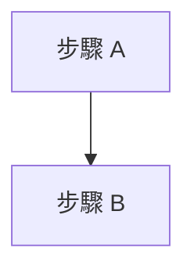

# <功能名稱> - <功能定位>

> <一句話說明本文件涵蓋內容>

---

##  Overview 功能概述

- 說明功能責任
- 列出核心檔案
- 描述與其他模組的關係

---

##  Core Concepts 核心概念

### 1. <概念 A>

### 2. <概念 B>

---

##  Code Walkthrough 程式碼解析

```typescript
// 放關鍵程式碼片段
```

---

##  Usage 使用方式

```tsx
// 放實際使用範例
```

---

##  Flow Diagram 流程圖



---

##  Key Points 重點總結

- 重點 1
- 重點 2
- 重點 3

---

##  Advanced Topics 進階概念

- 延伸優化方向
- 已知限制與改善方向
